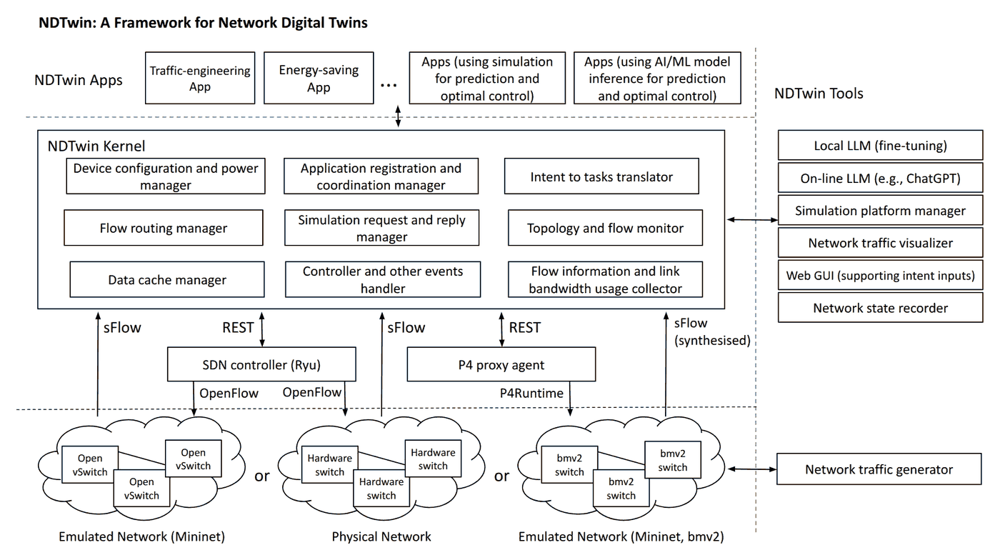
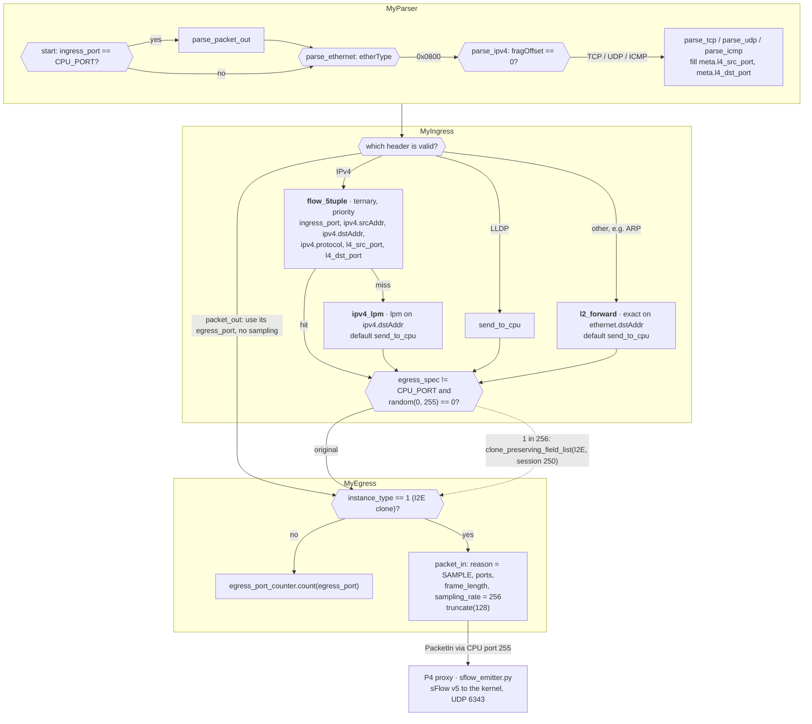

# NDTwin-Kernel-P4


> [!CAUTION]
> **Still under active maintenance — this version is published for testing only.**
> It is not a release. Expect defects, and treat anything you build on it as provisional:
> the contents can change without notice when the next snapshot is taken.

## What this is

[NDTwin](https://ndtwin.org) is a network digital twin: a live model that mirrors a real
network's topology, flow state and power state behind one REST API, so operators and
researchers can install rules, watch flows and inject or recover from faults against
something that behaves like the real fabric — without touching it directly.

This repository is the development line that adds **P4 / BMv2 data-plane support**
alongside NDTwin's original OpenFlow / Open vSwitch backend (Ryu-controlled). A P4Runtime
proxy (`p4_proxy/`) speaks gRPC to `simple_switch_grpc` and impersonates Ryu's northbound
API, so the kernel and every application above it work against either data plane
unmodified.



*The NDTwin architecture. Figure from the NDTwin project
([ndtwin-lab](https://github.com/ndtwin-lab), <https://ndtwin.org>), used with attribution.*

This repository's part is the right-hand path: the P4 proxy agent, REST towards the kernel
and P4Runtime towards bmv2. The figure draws the synthesised sFlow arrow straight from the
bmv2 network; concretely, the switches clone sampled packets to the proxy, and the proxy
encodes them as sFlow (`p4_proxy/proxy_agent/sflow_emitter.py`).

## Two data planes, one API

- **OVS + Ryu** — the original backend; OpenFlow via a Ryu controller.
- **P4 + BMv2** — this fork's addition; a Python proxy agent translates the kernel's REST
  calls into P4Runtime. Sampled packets come back through the same sFlow pipeline the kernel
  already uses (the proxy builds the sFlow v5 datagrams), and per-rule counters are served on
  the Ryu-compatible `/stats/flow/{dpid}` REST endpoint, so `FlowLinkUsageCollector`, the
  classifier and every `/ndt/` metric work without modification.

Both are driven through the same endpoints — install/delete/modify flow, group and meter
entries, topology and flow-usage queries, power management, and fault injection
(`inject_link_failure` / `inject_link_recovery`). See
[`doc/2026-01-02_ndt_api.md`](doc/2026-01-02_ndt_api.md).

### The P4 pipeline

The P4 plane runs [`p4_proxy/p4_src/ndtwin_switch.p4`](p4_proxy/p4_src/ndtwin_switch.p4)
(v1model, BMv2). `flow_5tuple` is applied first and `ipv4_lpm` only on a miss, so an
explicit 5-tuple rule beats the destination default; traffic that matches nothing goes to
the proxy as a packet-in. A random 1 in 256 of the packets not already headed for the CPU
is cloned to session 250. In egress the copy gets a `packet_in` header with its ports,
original frame length and sampling rate, is cut to 128 bytes, and the proxy turns it into
sFlow v5. 256 is OVS's `sampling=256`, so the kernel's rate arithmetic is the same on both
planes. Per-rule packet and byte counts come from direct counters on `flow_5tuple` and
`ipv4_lpm`, served in Ryu's `/stats/flow/<dpid>` shape.



The design notes behind each table and header are in
[`p4_proxy/p4_src/SPEC.md`](p4_proxy/p4_src/SPEC.md).

## Getting started (Please refer to https://ndtwin.org/ for full tutorial)

### Build

Requires a C++23 compiler, CMake ≥ 3.16, Ninja, Boost (`system`, `url`), OpenSSL, libssh.
`nlohmann/json` and `spdlog` are vendored under `libs/`.

```bash
sudo apt-get install g++ cmake ninja-build libboost-system-dev libboost-url-dev libssl-dev libssh-dev
cmake -S . -B build -DCMAKE_BUILD_TYPE=Release
cmake --build build
```

The first configure copies `setting/AppConfig.hpp.example` to `setting/AppConfig.hpp`;
edit that file to point at your topology file and controller/proxy addresses.

### Test

```bash
ctest --test-dir build --output-on-failure
```

CI (`.github/workflows/ci.yml`) also builds under ASan+UBSan and TSan, checks the build
under clang, and runs the Python test suite for the control-plane tooling. Those layers
cover build and unit tests; exercising a live topology is a manual step (below), since it
needs a real Mininet network namespace that a hosted CI runner doesn't have.

### Bring up a live fabric

```bash
tools/test_workflow/ndt status   # who's using it, right now
tools/test_workflow/ndt up       # OVS, 128 hosts (default plane)
tools/test_workflow/ndt up p4    # P4/BMv2 instead
tools/test_workflow/ndt down     # tear it down
```

A full walkthrough — bring-up, the test layers on top of a live fabric, and the
environment quirks that most often trip people up — is in
[`doc/2026-08-17_testing-manual.md`](doc/2026-08-17_testing-manual.md).

## Documentation

- [`doc/2026-01-02_ndt_api.md`](doc/2026-01-02_ndt_api.md) — REST API reference
- [`doc/2026-08-17_testing-manual.md`](doc/2026-08-17_testing-manual.md) — bring-up, test
  layers, environment gotchas
- [`doc/2026-07-27_p4_bmv2_support_plan.md`](doc/2026-07-27_p4_bmv2_support_plan.md) —
  design notes and progress for the P4/BMv2 backend
- [`doc/KNOWN-ISSUES.md`](doc/KNOWN-ISSUES.md) — a maintained log of known defects and
  their status; we'd rather you find them here than in your own results
- [`CHANGELOG.md`](CHANGELOG.md) — notable changes

## Status

Actively developed. This is a snapshot of an internal development branch, published for
testing and integration — not a tagged release. Interfaces, topology-file formats and
defaults can change between snapshots; see the caution above.

## License

Apache License 2.0 — see [`LICENSE`](LICENSE).
