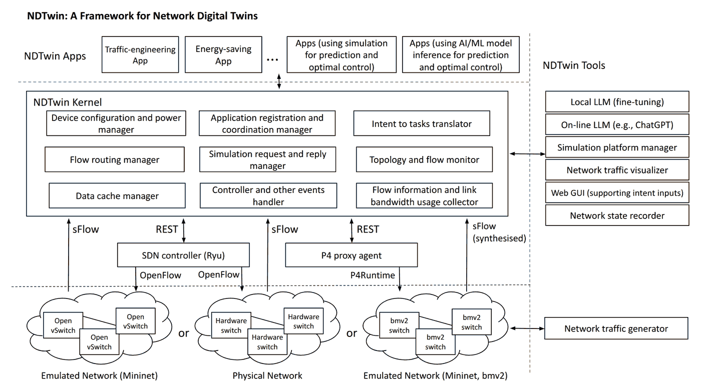
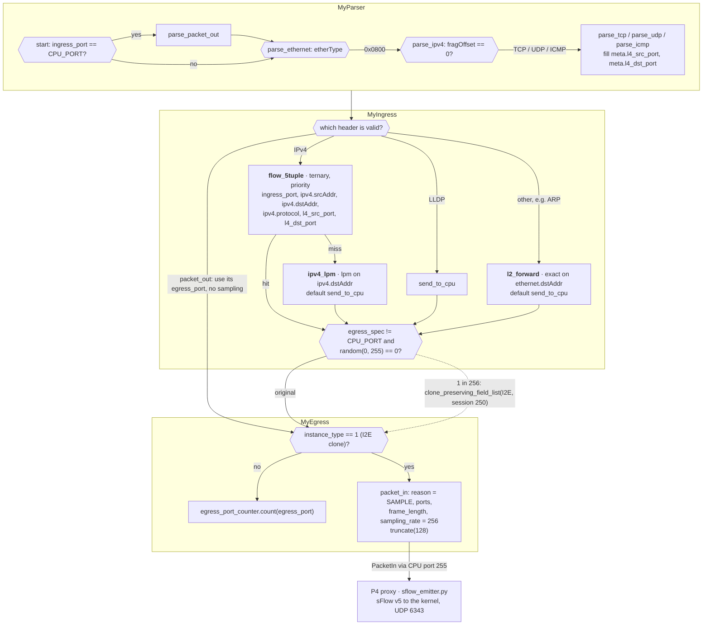

# NDTwin-Kernel-P4


> [!CAUTION]
> Under active maintenance. This version is published for testing only, not as a release.
> Expect defects and changes without notice.

[NDTwin](https://ndtwin.org) is a network digital twin. It mirrors a real network's
topology, flow state and power state behind one REST API, so you can install rules, watch
flows and inject faults without touching the real fabric.

This repository adds P4 / BMv2 data-plane support next to NDTwin's original OpenFlow /
Open vSwitch backend (controlled by Ryu). A P4Runtime proxy in `p4_proxy/` talks gRPC to
`simple_switch_grpc` and imitates Ryu's northbound API, so the kernel and the applications
above it work with either data plane.



*Figure from the NDTwin project ([ndtwin-lab](https://github.com/ndtwin-lab), <https://ndtwin.org>), used with attribution.*

This repository covers the right-hand path: the P4 proxy agent, with REST towards the
kernel and P4Runtime towards bmv2. The switches clone sampled packets to the proxy, which
encodes them as sFlow (`p4_proxy/proxy_agent/sflow_emitter.py`).

## Data planes

- OVS + Ryu: the original backend, OpenFlow through a Ryu controller.
- P4 + BMv2: the proxy agent turns the kernel's REST calls into P4Runtime. Sampled packets
  come back as sFlow v5 datagrams built by the proxy, and per-rule counters are served on
  the Ryu-compatible `/stats/flow/{dpid}` endpoint.

Both use the same endpoints: flow, group and meter entries, topology and flow-usage
queries, power management, and fault injection (`inject_link_failure` /
`inject_link_recovery`). See [`doc/2026-01-02_ndt_api.md`](doc/2026-01-02_ndt_api.md).

## P4 pipeline

[`p4_proxy/p4_src/ndtwin_switch.p4`](p4_proxy/p4_src/ndtwin_switch.p4) targets v1model on
BMv2. `flow_5tuple` is applied first and `ipv4_lpm` only on a miss, so an explicit 5-tuple
rule beats the destination default. Traffic that matches nothing goes to the proxy as a
packet-in. A random 1 in 256 of the packets not already headed for the CPU is cloned to
session 250. In egress the copy gets a `packet_in` header (ports, original frame length,
sampling rate) and is cut to 128 bytes. The proxy turns it into sFlow v5. 256 matches OVS's
`sampling=256`, so the kernel's rate arithmetic is the same on both planes. Per-rule packet
and byte counts come from direct counters on `flow_5tuple` and `ipv4_lpm`.


```mermaid
flowchart TD
    subgraph PARSER["MyParser"]
        start{{"start: ingress_port == CPU_PORT?"}}
        pout["parse_packet_out"]
        eth{{"parse_ethernet: etherType"}}
        ipv4{{"parse_ipv4: fragOffset == 0?"}}
        l4["parse_tcp / parse_udp / parse_icmp<br/>fill meta.l4_src_port, meta.l4_dst_port"]
        start -- yes --> pout --> eth
        start -- no --> eth
        eth -- "0x0800" --> ipv4
        ipv4 -- "TCP / UDP / ICMP" --> l4
    end

    subgraph INGRESS["MyIngress"]
        which{{"which header is valid?"}}
        f5["<b>flow_5tuple</b> · ternary, priority<br/>ingress_port, ipv4.srcAddr, ipv4.dstAddr,<br/>ipv4.protocol, l4_src_port, l4_dst_port"]
        lpm["<b>ipv4_lpm</b> · lpm on ipv4.dstAddr<br/>default send_to_cpu"]
        lldp["send_to_cpu"]
        l2["<b>l2_forward</b> · exact on ethernet.dstAddr<br/>default send_to_cpu"]
        samp{{"egress_spec != CPU_PORT and<br/>random(0, 255) == 0?"}}
        which -- IPv4 --> f5
        f5 -- miss --> lpm
        which -- "LLDP" --> lldp
        which -- "other, e.g. ARP" --> l2
        f5 -- hit --> samp
        lpm --> samp
        lldp --> samp
        l2 --> samp
    end

    subgraph EGRESS["MyEgress"]
        inst{{"instance_type == 1 (I2E clone)?"}}
        real["egress_port_counter.count(egress_port)"]
        copy["packet_in: reason = SAMPLE, ports,<br/>frame_length, sampling_rate = 256<br/>truncate(128)"]
        inst -- no --> real
        inst -- yes --> copy
    end

    proxy["P4 proxy · sflow_emitter.py<br/>sFlow v5 to the kernel, UDP 6343"]

    PARSER --> which
    which -- "packet_out: use its egress_port, no sampling" --> inst
    samp -- "original" --> inst
    samp -. "1 in 256: clone_preserving_field_list(I2E, session 250)" .-> inst
    copy -- "PacketIn via CPU port 255" --> proxy
```

Notes on each table and header: [`p4_proxy/p4_src/SPEC.md`](p4_proxy/p4_src/SPEC.md).

## Build

Needs a C++23 compiler, CMake 3.16+, Ninja, Boost (`system`, `url`), OpenSSL and libssh.
`nlohmann/json` and `spdlog` are vendored under `libs/`. Full tutorial: https://ndtwin.org/

```bash
sudo apt-get install g++ cmake ninja-build libboost-system-dev libboost-url-dev libssl-dev libssh-dev
cmake -S . -B build -DCMAKE_BUILD_TYPE=Release
cmake --build build
```

The first configure copies `setting/AppConfig.hpp.example` to `setting/AppConfig.hpp`.
Edit it to point at your topology file and controller/proxy addresses.

## Test

```bash
ctest --test-dir build --output-on-failure
```

CI (`.github/workflows/ci.yml`) also builds under ASan+UBSan and TSan, builds with clang,
and runs the Python tests for the control-plane tooling. Testing against a live topology is
manual, because it needs a Mininet network namespace that hosted runners don't have.

## Live fabric

```bash
tools/test_workflow/ndt status   # who's using it
tools/test_workflow/ndt up       # OVS, 128 hosts (default plane)
tools/test_workflow/ndt up p4    # P4/BMv2 instead
tools/test_workflow/ndt down     # tear it down
```

Bring-up, test layers and common environment problems are in
[`doc/2026-08-17_testing-manual.md`](doc/2026-08-17_testing-manual.md).

## Docs

- [`doc/2026-01-02_ndt_api.md`](doc/2026-01-02_ndt_api.md): REST API reference
- [`doc/2026-08-17_testing-manual.md`](doc/2026-08-17_testing-manual.md): testing manual
- [`doc/2026-07-27_p4_bmv2_support_plan.md`](doc/2026-07-27_p4_bmv2_support_plan.md): P4/BMv2 design notes and progress
- [`doc/KNOWN-ISSUES.md`](doc/KNOWN-ISSUES.md): known defects and their status
- [`CHANGELOG.md`](CHANGELOG.md)

## Status

Snapshot of an internal development branch, not a tagged release. Interfaces,
topology-file formats and defaults can change between snapshots.

## License

Apache License 2.0, see [`LICENSE`](LICENSE).
