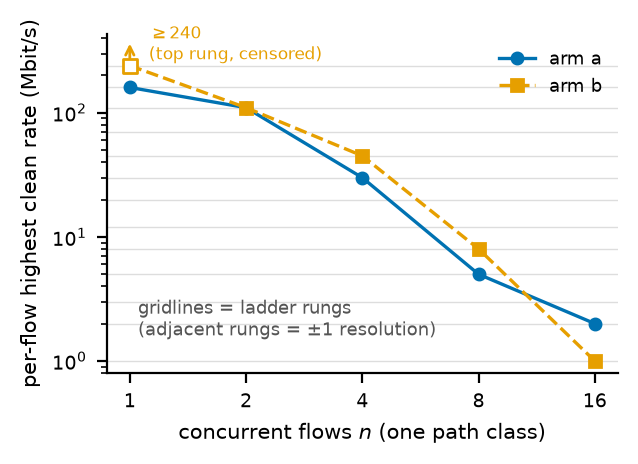
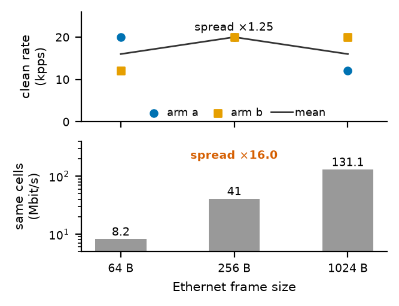
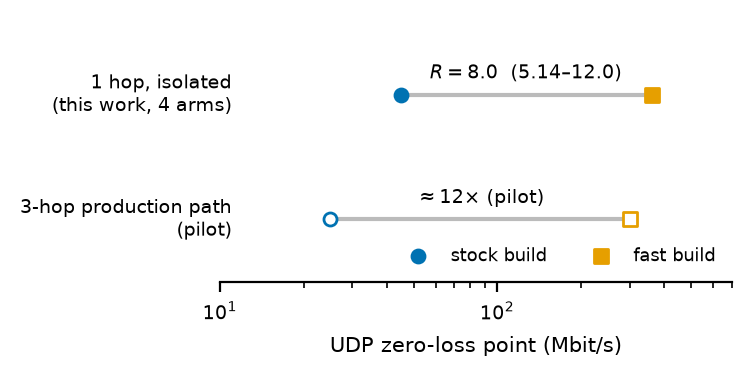
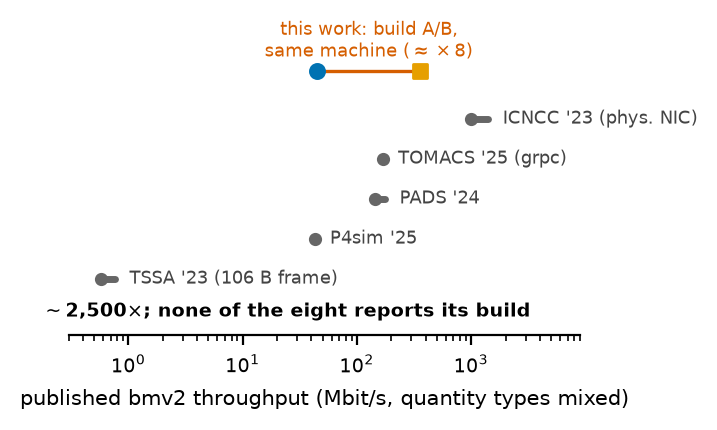

# bmv2 效能量測研究：貢獻報告

**建立日 2026-08-29（深夜）。** 委託：8/28 auditor（Adam 指定的第一優先）。
**這是什麼**：三個宣稱的單一入口——related work、方法、威脅到效度**定稿**；
**§4 已由 ①②③ 收案填入（08-29：①＝H2、②＝H1、③＝兩臂單調）**；OVS 同梯對照
**08-30 已收（H-B，`8/29 poster-reviewer` 執行）**——§4 全格無待辦。
**這不是什麼**：不是檢索紀錄（那在 `audit/2026-08-28_bmv2-literature-review/`）、
不是量測報告（①②③ 各自的 audit 目錄才是）。

🔴 **填空規則（先於任何數字）**：§4 的空位**只能**由收案的 audit 目錄填入，
且填入時要記臂數與 pass。**pilot 數字（08-15 報告）只出現在動機與方法的「比較基準」欄，
一律帶 pilot 標記，永不進 §4。** 單流錨點、已撤回的舊倍率、以及任何「無損門檻÷飽和膝蓋」型的跨類比值**整份不引用**
（理由見 §3-3 與 §5-6：階梯解析度假象＋異類相除，08-29 裁定）。

**標註約定**（沿 `GAP.md`）：〔O〕＝論文寫著；〔I〕＝我們的推論或換算。

---

## 0. 一句話，與三個宣稱

> **bmv2 的已發表效能數字互相不可比較，因為一個值一個數量級的變數（build 組態）
> 沒有人報告；我們量化那個變數、指認天花板的真正單位（pps）、
> 並在受控條件下量測流數對每流乾淨速率的效應（同梯對照平面＝已註冊的下一輪）。**

### 給 Adam 的白話版（一段）

大家發表 bmv2 的效能數字時，都沒有寫自己是怎麼編譯它的——而編譯方式（開不開
logging、開不開最佳化）在同一台機器上就能差近一個數量級（我們隔離量到 8 倍；
在三跳生產路徑上是 12 倍）。這件事社群其實「知道」
（官方 README 和論壇都寫了），但**論文裡從來沒有人報告過、更沒有人量化過**——
於是 18 篇文獻裡的 bmv2 吞吐數字橫跨約 2,500 倍，任兩個數字都無法判定是不是在量
同一個東西，甚至有兩篇同儕審查論文對「bmv2 和 OVS 誰快」給出相反排序。我們做三件事：
把這個變數第一次隔離量化（①：隔離單跳＝8.0 倍、生產路徑＝12 倍——差額屬於路徑
還是控制平面，留給已註冊的下一輪）；證明它的天花板該用「每秒幾個封包」而不是「每秒幾個
bit」來講，所以用 Mbps 報告本身就會誤導（②）；證明多開幾條流時，bmv2 每一條流跑得到的乾淨速率會急遽下降，
OVS 那邊是不是也這樣，同一把梯子的對照還沒跑（③）。貢獻的類型是 measurement study——
和 Mytkowicz et al.（ASPLOS '09）「一個沒人報告的瑣碎變數就能推翻已發表比較」同一個文類。

### 三個宣稱（C1–C3），與各自的證據現狀

| # | 宣稱（投稿口徑，字斟句酌過） | 文獻側 | 我方量測側 |
|---|---|---|---|
| **C1** | 一個文獻中無人報告的變數——**複合 build 組態**（官方建議 `-O3 --disable-logging-macros --disable-elogger` **＋我們自加的 `-DNDEBUG -march=native -fno-semantic-interposition`**，vs p4-guide 安裝器逐字的 `-O0`＋logging）——**在三跳生產路徑上值 12×（UDP 零損點）；隔離到單跳、控制平面仍活著時，量到 8.0×**（梯階量化區間 5.14–12.0、膝蓋內插 ≈7.8）。⚠️ 08-29 外審更正：fast 非純官方建議組態 ⇒ **R=8.0 對「官方建議組態本身」是上界**；`-march=native` 使 fast 僅功能等價可重建（非逐 byte）。**差額的歸屬——路徑長度還是控制平面——本輪不可推論，已預先註冊為另一輪。** 兩個情境值都大到使 **18 篇無 build 資訊的已發表數字互相不可比較** | ✅ 定稿（§2） | ✅ **已收案（H2，①＋①b 六–四臂零散布；§4）** |
| **C2** | bmv2 的轉發天花板由 **pps 決定、不是 bps**——**用 Mbps 報 bmv2 容量而不載明封包大小，不是「不夠精確」，是一個 16 倍的歧義**（同一批乾淨階資料：pps 變 1.25×、bit rate 變 16.0×），而這 18 篇全部用 Mbps、無一載明封包大小；軸沿用隔壁社群標準（64/256/1024 B frame，RFC 2544／NetSoft '19／CompNet 2021），刻意不自創 | ✅ 定稿（§2） | ✅ **已收案（H1，兩臂）**——§4 |
| **C3** | 固定拓樸、host 不超載、**每格 n 條流全綁同一 path class（flows/switch＝flows/link＝n by construction）**時，**每流最高乾淨速率隨流數單調下降**；OVS 對照＝**已收（08-30 同梯同置放對照，H-B）**〔沿革——08-29 N-1：舊 OVS 量測只支持「**合計**不降」（單流 ~400、16 流合計 480），其**每流** 400→30 也在降——與本宣稱不同量，不得當方向性支撐；**08-30 已跑**：valid 每流 clean 540/240/45（n=1/4/16、鏡像兩臂全同階、零 ECMP 散佈由 switch 計數器證實、n=1 格＝收端 socket 限）＝**合計天花板（0.72–0.96 G）均分、aggregate 不塌；bmv2 aggregate 自塌 ~10×、n=16 每流差 22–45×**；正本 `audit/2026-08-30_ovs-flowcount-control/FINDINGS.md`，紅線 f＝本輪數字不回填 C1/C2〕——18 篇裡沒有等價量測（隔離流數＋帶對照平面兩個條件同時成立的：0 篇）。〔口徑 08-29 改寫：原「同路徑 16 流總和塌 3.3×」兩個成分都錯——「同路徑」不成立、比值係異類相除已撤回；見 §3-3／§5-6〕 | ✅ 定稿（§2） | ✅ **雙半皆收**：bmv2 半（兩臂單調）＋OVS 半（08-30 同梯同置放，H-B）——§4 |

🔴 **措辭紅線**（8/27–8/28 兩任 auditor 已裁，不可回退）：
- 是「互相**不可比較**」不是「不可複現」——後者要做重現實驗才能講，我們只做了閱讀。
- 否定句主詞一律「**這 18 篇**」，不是「文獻」——檢索覆蓋邊界見 §5-4。
- 12–18× 是**跨指標的範圍**（UDP 零損點 12×、TCP 單流 17.8×……），不是信賴區間；
  比較與收案只對 **12×（UDP 零損點）** 這一個量（PREREG ① §2）。
- **① 收案三禁（08-29 auditor 裁）**：不准只報 12×；不准只報 8.0× 而不講它是單跳；
  不准把差額歸因給路徑或控制平面——本輪只拆了路徑一個變數（`FINDINGS-1b.md` §1.4，
  註冊於任何臂開跑之前）。

---

## 1. 動機：為什麼值得做

1. **spread 表**：18 篇中量過 bmv2 的 12 篇（**其中報吞吐的 10 篇**——另 2 篇僅量
   latency/delay），自陳吞吐橫跨 **~0.57 Mbps 到 ~1.4 Gbps（~2,500×）**，12 篇中
   **零篇**給出足以重建其 binary 的資訊〔O＋I；逐篇見 §2-1；08-29 驗收波更正母體：
   **比值的兩邊要同一個母體**——spread 的母體是 10、build 揭露統計的母體是 12〕。
2. **同一 corpus 裡有兩篇論文對 bmv2-vs-OVS 給出相反排序**（Chen 組：OVS 快
   兩個數量級；Fernando 2025：SDN+P4 > SDN+OvS）——後者機制是 ONOS reactive 模式下的
   控制面政策差異〔O，論文自述〕，但**兩篇都無 build 資訊，讀者無從裁決**〔I〕。
   〔⚠️ 08-30 surveyed-author 更正裁決理由：Fernando 的不可裁決主因＝**工作點距
   datapath 天花板 3–6 個數量級**（§2-1 列 11、不入 spread 統計）——兩篇量的不是
   同一件事，而 corpus 讓讀者看不出來；「無 build」兩篇皆真，但把 Fernando 的不可
   裁決歸因給 build＝我們自己指控的錯配，abstract 同句已改。〕
   〔08-29 外審更正＋同日解決：corpus 原引的是 preprint（首頁印 "Not peer-reviewed
   version"）⇒ 一度禁寫「同儕審查」；**期刊版（*Network* 5(2), 21, DOI
   `10.3390/network5020021`）已人工逐字核對**——「SDN+P4 outperform SDN+OvS
   significantly」在期刊摘要原句、reactive/PACKET_IN 自我歸因段同在、關鍵數字同
   （6300 bps、UDP +43%）、build/variant 仍零揭露 ⇒ **「同儕審查」措辭恢復**，
   引用一律指期刊版；08-30 審查 session 對 Adam 下載的期刊 PDF 逐頁複核＝第二次
   核對（MDPI "Article"、Received 28 Apr／Revised 31 May／Accepted 9 Jun、
   Academic Editor 齊備；作者列逐字符合；排序句與 reactive 自我歸因原句皆在）。〕
3. **同一實驗室內部都不可比較**：Jin 組相鄰兩篇的每-switch RTT 差 **1.7×**
   （PADS '24 native 1.217 ms vs PADS '26 迴歸 729.4 µs），不同機器、皆無 build 資訊
   〔O＋I；`SEARCH-ROUND-1.md` §2〕。
4. **知識存在於專案文件、規範不存在於文獻**：官方 `docs/performance.md` 把「用什麼
   flags 編譯」列為影響效能的首要變數——原句 "which flags were used to build bmv2:
   this can have a massive impact."（**08-29 更正：先前誤植為 README 且引文遭拼裝**
   ——README 實句只有 `--disable-logging-macros` 的效能說明；本句已對 main 與
   `f0b7d201` 兩版逐字驗）；同一份文件給了建議 flags 與參考數字
   （~1,047 Mbps 中位／80 kpps，c4.2xlarge）；issues #311/#823、Stack Overflow 都在講
   這件事——**而 18 篇裡 0 篇報告自己的 build，兩篇引用了 `performance.md` 的論文
   （ICNCC、TSSA）自己的 build 仍隻字未提**〔O〕。審稿人「這是已知 folklore、不算新」
   的反駁，答案就是這個落差本身：**folk knowledge ≠ 報告規範**。
5. **變數的大小，pilot 已經量到**：08-15 報告（3-hop 生產 stack、n=1–2、raw 未保存）
   顯示兩顆 build 差 12–18×（跨指標）。它的三個效度缺陷——非隔離工作點、n 不足、
   raw 死了——**正是 ①②③ 以預註冊重量的理由**，不是可以將就引用的理由。
   〔08-29 收案：① 落 **H2**——重量的理由被結果證實，**那個 12× 真的有一部分
   不屬於編譯旗標**；隔離值 8.0×，見 §4。〕

**貢獻類型的定位**：measurement study／benchmarking-reproducibility，文類先例是
Mytkowicz et al., *Producing Wrong Data Without Doing Anything Obviously Wrong!*
（ASPLOS '09；環境變數與連結順序等「沒人報告的變數」推翻已發表比較）。我們是同一個
論證形狀在 P4 模擬圈的實例化——**變數不同、圈子不同、後果同型**〔I；定位用，
該文不在 18 篇 corpus 內〕。

### 5-7 預告（動機收尾）：同一晚三個「長得像量測值、其實是儀器極限」的數字

**160**（梯子的頂平台，不是交換機的門檻）、**② 若 gate 不過時的 pps 平線**（會是發送端
的極限）、**③ 的註冊區間**（錨在第一例上）。⇒ 貫穿三個工單的方法學規則：**任何要進
模型或比值的數字，先問「它是不是它的儀器的極限」**（上界、頂階、解析度、預設值）。
詳 §5-6／§5-7。

---

## 2. Related work（定稿）

### 2-1. 18 篇普查表

「未載明」＝該篇全文找不到；**這一欄的密度本身就是 C1 的證據**。
逐篇數字、行號、sha256 見 `audit/2026-08-28_bmv2-literature-review/`
（`RELATED-WORK.md` §1、`SEARCH-ROUND-1.md` §2、`MANIFEST.md`）。

| # | 篇（venue） | 量 bmv2？ | 變體 | 版本 | build flags | 該篇的 bmv2 頭條數字 |
|---|---|---|---|---|---|---|
| 1 | Chen/Hu/Qu/Jin, **TOMACS 2025** | ✅ | `simple_switch_grpc` ✅ | ✗ | ✗（僅 runtime tracing −30.7%） | grpc 天花板 ~170 Mbps；另述 `simple_switch` 可到 1 Gbps；OVS 對照 30 Gbps |
| 2 | 同組, **SIGSIM-PADS '23** | ✅ | 同上 ✅ | ✗ | ✗ | 同核心數字；ring 256-sw 每對 1000→212 Mbps |
| 3 | Waind et al., **SIGSIM-PADS '24** | ✅ | ✗ | ✗ | ✗ | 單 switch ~175（native）／~145 Mbps（VM）；每 sw RTT 1.217 ms |
| 4 | Kumazoe et al., **ICNCC 2023** | ✅ | ✗ | **1.15 ✅** | 🟡 唯一質性敘述：「以不產生 log 的模式編譯」；無 flags、無對照 | 1 Gbps 無損；均值天花板 ~1.4 Gbps；T4P4S 對照 2.3/2.6 Gbps |
| 5 | Hasnaa et al., **TSSA 2023** | ✅ | ✗ | ✗ | ✗（引了 `performance.md` 仍未報） | 64 B：574.4–756.7 Kbps；128 B：1022–1040 Kbps（詳 §2-3） |
| 6 | Dang et al., *Whippersnapper*, **SOSR '17** | ✅（僅 latency） | ✗ | ✗ | ✗ | parse 1 header 11.2 **ms**（PISCES 同項 ~5 µs） |
| 7 | Kohler et al., *P4CEP*, **NetCompute '18** | ✅ | ✗ | ✗ | ✗ | 🔑 corpus 唯一 pps 本位：min-size ≈**12 kpps**（線速 0.08%） |
| 8 | Chen et al., *P4-NIDS*（arXiv 2024） | ✅ | ✗ | ✗ | ✗ | ~80 Mbit/s 量級；⚠️ 自述 CPU 恆 0.3%（量測假象同型，存疑照錄） |
| 9 | PoliTO 碩論（delay control） | ✅（僅 delay） | ✗ | ✗ | ✗ | RTT 基線 0.98 ms（VM）／2.16 ms（實體） |
| 10 | Waind & Jin, **SIGSIM-PADS '26** | ✅ | `simple_switch_grpc` ✅ | ✗ | ✗ | 每 sw RTT 迴歸 729.4 µs（↔ #3 同組差 1.7×） |
| 11 | Fernando et al., **MDPI Network 2025** | ✅ | ✗ | ✗ | ✗ | SDN+P4 > SDN+OvS（reactive 控制面機制）；工作點 6.3 Kbps–96 Mbps，距 datapath 天花板 3–6 個數量級 ⇒ 不入 spread 統計 |
| 12 | Ma & Nguyen, *P4sim*（arXiv 2503.17554, 2025；**已親驗**，MANIFEST `P4SIM25`） | ✅ | ✗ | ✗ | ✗ | bmv2（Mininet baseline）飽和 ~43 Mbps |
| 13 | Zhang et al., **Computer Networks 188 (2021)** | ❌（7 switch 無 bmv2） | — | — | — | 🔑 對照組：逐 switch 給 commit（FastClick 9d5e9c6、t4p4s b1161b2…）＋附錄逐 switch 參數＋單核釘住定頻 |
| 14 | Zhang et al., **NetSoft 2019** | ❌ | — | — | — | 64/256/1024 B ＋ Mpps 本位＝②的軸的出處 |
| 15 | Tsareva et al., TUM seminar SS21（survey） | ➖ 轉述 | — | — | — | 「up to 1 Gbit/s」無 build 出處地流傳；jitter 列 future work |
| 16 | *vSDNEmul*（arXiv） | ❌（OVS 系） | — | — | — | 容器模擬器 fidelity 問題形狀早於 P4 |
| 17 | Huang et al., **HotSDN '13** | ❌（前 P4） | — | — | — | 「量真 switch→模擬器內建模型」路線（flow setup 42–408 f/s） |
| 18 | *P4Docker*（2024） | ❌（工具論文） | — | — | — | 效能比較明列 future work |

**統計（量 bmv2 的 12 篇）**：build flags **0/12**；build 對照實驗 **0/12**；
質性 build 敘述 1/12（ICNCC）；變體載明 **3/12**——**且三篇全部出自同一實驗室譜系
（Jin 組）**；版本載明 1/12（ICNCC 1.15）。對 bmv2 的封包大小掃描 0/12
（TSSA 兩點有質性歸因、未換算 pps，§2-3）；pps 本位 1/12（P4CEP 單點）；
固定拓樸下把流數當自變數 **0/12**；多流條件下帶對照平面 **0/12**。
⚠️〔08-30 surveyed-author 註〕TOMACS'25＝PADS'23 的期刊擴充（本表列 1、2「同核心
數字」）：以**發表紀錄**計變體載明＝3/12，以**獨立工作**計＝2/11——兩種算法都
all one lineage、論點不變，但引用本統計時要載明用的是哪種母體。

### 2-2. C1 的最近先行與差異

- **最接近的揭露**是 ICNCC 一句質性敘述（無 flags、無對照）；**最接近的量化**是
  Chen 組自陳各變體 "the maximum throughput ranges from 40 Mbps to 1 Gbps"
  （PADS '23）——**指認了變數存在、寫出範圍、然後沒有控制它也沒說自己用哪種**〔O〕。
  ⚠️ 且那是「變體」軸；build 未控的前提下，**「變體差異」與「build 差異」在這
  18 篇裡不可分離**〔I〕——這正是 ① 之後的 2×2 交叉（GAP §4-4）要拆的。
- **要和 TOMACS 的 −30.7% 分開**：那是 runtime tracing 旗標的代價〔O〕；
  **編譯期**把 logging 移除是一個數量級〔pilot〕。兩者常被混為一談。
- **對照組**：CompNet 2021 證明 commit 級 provenance 在隔壁 NFV benchmark 社群是
  **現行標準**〔O〕——缺的是這個圈子的規範，不是學科的能力。

### 2-3. C2 的最近先行與差異

- **TSSA 2023 的兩點資料是最好的展品**：64 B 三情境 574.4／630.7／756.7 Kbps，
  128 B 三情境 1031／1022／1040 Kbps〔O〕。**逐情境配對換算 pps**：
  64 B 側 ~1.1–1.5 kpps、128 B 側 ~1.0 kpps，**pps(128)/pps(64) = 0.69–0.90**——
  頻寬受限假說預測 0.5、每包成本假說預測 1.0，**三情境中兩情境偏 pps 恆定端
  （Forwarding 0.897、MPLS Basic 0.810）；MPLS Stacked 0.687 低於線性中點 0.75 與
  幾何中點 0.707、偏頻寬側**〔I：我們的換算；08-30 surveyed-author 更正——先前
  「三情境全數偏恆定端」過強；論文全篇 Kbps 敘事，未計算 pps，把 128 B 的改善歸因
  「datagram 較少→較不會丟」＝每包成本機制的質性版，「未分析」的說法不成立、
  未做的是 pps 換算〕。**資料裡有、結論裡沒有。**
  ⚠️ 且 TSSA 自述其 64/128 B 是 iperf「buffer length」〔O〕＝ **UDP payload 不是
  Ethernet frame**〔I〕——frame/payload 混用正是 ② 的 PREREG 明文防的軸轉換陷阱
  （§3-2）；在 NFV frame 軸上這兩點該畫在 106/170 B。
- **P4CEP 是唯一 pps 本位的 bmv2 數字**（≈12 kpps，單點）——無大小掃描、
  無「與包長無關」宣稱〔O〕。
- **軸本身是隔壁社群的標配**（NetSoft '19／CompNet 2021：64/256/1024 B、Mpps 本位、
  "regardless of the packet size" 式分析）——**受測清單無 bmv2**〔O〕。
  ⇒ ② 的貢獻形狀是「把標準軸第一次補到 bmv2 身上＋fidelity 語境的後果」，
  不是發明新方法〔I〕。

### 2-4. C3 的最近先行與差異

**Chen 組量化了症狀、但從未隔離變因**（08-28 更正過的口徑；先前寫「沒有量化」過強）：
256-switch ring、路徑不重疊，其他 host 開傳後每對 1000→**212 Mbps**〔O〕。他們沒做的
三件〔O＋I〕：(a) 流數從未單獨作為自變數——與「活躍 switch 容器數」在 256-sw
host 超載設計裡綁死；(b) 該實驗**無 OVS 對照臂**（OVS 只出現在別的實驗）；
(c) 只報 per-pair、無同路徑**總和**視角。TOMACS 的 ECMP 場景（16/4/1 流）同樣把
流數與拓樸層級混雜〔O〕。其餘各篇：ICNCC 全程單流、餘無多流實驗〔O〕。
⇒ **「隔離流數」＋「帶對照平面」兩個條件同時成立的量測：這 18 篇裡 0 篇**。
可比性但書：Chen 組用 TCP、我們用 UDP；256-sw vs 10-sw——引用 212 當「同現象的
另一個工作點」可以，當「同一實驗的另一組」不行。

### 2-5. 與 virtual-time 路線（TOMACS）的關係：互補，不對撞

TDF 的 runtime 成本與效能缺口成正比（TDF=2 ⇒ 2× 牆鐘時間〔O，PADS '23〕）
⇒ **快 12–18× 的 build 把所需 TDF 除以同一個倍數**〔I〕。「先修 build、再上
virtual time」這個順序，這 18 篇裡沒人說過。TOMACS 是引子不是障礙。
另一條互補線：HotSDN '13 的「量測→建模型」路線在 bmv2 時代無人接續
（Chen 組走縮時間、不改行為模型）〔O＋I〕——數位分身是這條路線的現代形，
屬 NDTwin 定位敘事、不是本篇主菜（GAP §4-7）。

---

## 3. 方法（定稿）

### 3-0. 三個工單共通的紀律

| 紀律 | 內容 | 為什麼 |
|---|---|---|
| **binary 指認** | ⚠️ **08-29 更正：逐臂符號簽名（`nm`／EventLogger 雙向）僅 ①**；②③ 的腳本以 `pgrep -af` 讀 argv 路徑＋繼承未重啟的 fabric（**較弱，照實揭露**——連 DeepSeek 外審這條都對、我們先擋錯了）；kernel 另有符號＋陰性對照逐臂 | PATH／argv 上那顆不一定是 fabric 跑的（已付過學費）；mtime 連下界都給不了 |
| **陰性對照** | 簽名檢查先對「應該答 no」的 binary（`3367d0e9`）跑一次並記錄 | 沒有應答 no 的對照，「簽名命中」與「grep 壞了」是同一個觀察 |
| **複製單位＝臂** | 每格 ≥2 臂、跨格交錯＋鏡像排程（如 `1 2 4 8 16 \| 16 8 4 2 1`） | 臂內 rep 只是同一臂的重讀；鏡像使線性漂移不與任一格對齊 |
| **clean 判定** | 首讀非零損失 ⇒ 3 reps 取**中位**；>2.0% 單 rep 判 dirty；**最終回報的最高 clean 階無論首讀為何一律 3 reps 再確認**，且首讀與確認都記錄 | 門檻（0.5%）坐在錨點階自己的噪聲腰上（實測同階 span 0.0665–0.5006%）；唯一能被單 rep 裁定的讀值是精確 0，而 0 也只證明「這一 draw 沒丟」 |
| **負載 gate** | 量測窗內 `/proc/stat` delta 的 busy fraction，超出中位臂 0.15（絕對值）⇒ 整臂重跑；`load1` 降為 pre-screen | `load1` 在 14 核上是落後＋複合指標，且會對臂自己的轉發負載發火——gate 不能對它要保護的訊號發火 |
| **量測窗內不 commit** | commit 觸發背景 `agy` review（實測 207% CPU、突發） | 記錄實驗的動作本身污染實驗 |
| **雙讀值** | iperf3 `sum_sent`/`sum_received` ＋ 介面計數器，**每臂都收** | 收端 socket 滿的時候，iperf3 的數字「長得像轉發極限」（§3-3） |
| **raw 歸檔** | raw 一律進 `audit-raw` 分支；圖表以內容雜湊引用。**守衛是單向的**——`pre-commit` 只在 commit 當下攔截 raw 出現在工作分支（`tools/githooks/pre-commit:32` 對 `audit-raw` 直接放行、其餘檢查 raw 路徑是否出現），**它不能、也沒有檢查 raw 是否已經進入 `audit-raw`**；一輪若從頭到尾不 commit 它的 raw，repo 中沒有任何機制會出聲。因此本列描述的是**規範**與**擋錯目的地的機制**，不是自動化保證。 | 08-15 的教訓：raw 沒保住，宣稱就要重量。🔴 08-31 更正：原文寫「pre-commit hook 強制」高估了守衛——實測 15 輪、533.2 MiB 的 raw 從未進入任何 object store，而**沒有一輪宣稱過相反的事**（缺口是沉默，不是假話） |

### 3-1. 工單 ①——單 switch 隔離工作點：12× 是 build 的性質還是路徑的性質？

- **混淆因子**：pilot 的每個數字都量在 3-hop 生產 stack 上（proxy 推路由、kernel
  輪詢、sFlow clone 全開）⇒ 分不開「build 快 12×」與「build 在這條路徑上快 12×」。
  論文要講前者，pilot 只量過後者。
- **設計**：同一台 switch 掛兩 host、單 hop；臂＝兩顆 build，
  交錯 `fast stock fast stock` 再鏡像；×1.5 階梯延伸到 stock 預期區。
- **比較基準只有 12×（UDP 零損點；pilot：stock 25 → fast 300 Mbps，3-hop）**——
  跨指標範圍的其他列（TCP 17.8× 等）不得用於對帳，否則幾乎任何數字都能「吻合」。
- **讀值配對**：單 hop 上「ingress-port RX vs egress-port TX」配對無歧義——
  pilot 量到損失發生在 bmv2 行程的輸入緩衝**內**，per-interface drop 計數器看不見
  （RX 89,296、TX 33,456、介面損失 0）；這是隔離拓樸值得付 fabric 重啟代價的
  第二個理由。
- **成本自覺**：換 build＝重啟 fabric＝銷毀現行 binary 指認與暖 fabric ⇒ 排在 ③ 之後。
- 〔**08-29 收案（兩輪）**：① 的註冊梯（頂 360）**只對著慢臂檢查過**——由 ③ 的梯往下
  延伸、沒人問頂端夠不夠 fast 在單跳用 ⇒ fast 兩臂在梯尾仍乾淨＝截尾，R≥8.0 無裁決；
  **①b 把梯頂交給停止規則**（爬到 540/810、每臂由 loss 終止），fast 側 360 成為真量測，
  R=8.0 落 H2——詳 §4。發送端對照以 **1400 B 新量**（7902 Mbit 對最高階 810 M＝9.8×；
  ② 的 64 B 對照不可跨尺寸繼承）。註冊的 8 臂鏡像兩輪都沒跑（各 4 臂交錯）——§5-9。〕

### 3-2. 工單 ②——封包大小掃描：天花板是 pps 還是 bps？

- **軸是別人的，故意的**：64／256／1024 B **frame**（NetSoft '19／CompNet 2021 的軸）
  ——發明自己的軸會讓結果對不上它要插進去的文獻。
- **frame ≠ payload，轉換不可省**：iperf3 `-l` 是 UDP payload；frame＝payload＋42
  （UDP 8＋IPv4 20＋Ethernet 14）⇒ `-l 22/214/982`。跑 `-l 64` 會量到 106 B frame
  並產出一條無法對照任何論文的曲線。**每點的 meta 同時記兩個數。**
  （TSSA 的兩點正是這個陷阱的文獻活例，§2-3。）
- 🔴 **會偽造頭條的混淆因子**：「pps 跨大小恆定」**正是發送端受限實驗會產出的結果**
  ——若產生器在 64 B 先撞到自己的 pps 天花板，掃描回傳一條平線，而那條平線是
  產生器的不是 bmv2 的。頭條與假象在資料裡不可分（「最下游瓶頸遮住上游」同型）。
  ⇒ **註冊 gate（先於任何 bmv2 臂，過與不過都記錄）**：64 B frame 不經 bmv2 的
  loopback/直連必須撐到本輪 bmv2 最高 64 B pps 的 **5×**，否則整輪只准報
  「generator-limited at 64 B」。
- **08-15 的 loopback 對照（42.4／63.5 Gbit/s）不能充當這個 gate**：那是 1400 B 的
  量測；小包產生受限於每包成本不是頻寬，1400 B 的結果對 64 B 的 pps 上限零證據力。
- **主讀值是 pps，由送達 datagram 數÷時長算出**——不從 bps 反除名目大小，
  否則把結論烘進讀值。bps 同錄（兩假說對它預測相反，只報其一＝事後選邊）。
- **pilot 動機（帶未決但書）**：08-15 表換算 stock 在 1400 B 送達天花板 ~3.66 kpps、
  64 B 實測 3.62 kpps——近恆定〔I〕。⚠️ 該表的「64 B」是 frame 還是 payload
  **未載明**，已註冊為未決：在從 raw 判明之前，不得拿本輪結果與它對帳。
  〔**08-29 收案**：gate 實測過關 **9.6×**（770.7 kpps 對需求 80.0，為此新量的 64 B
  對照）；兩個註冊比值皆落 **H1**——數字見 §4，閘門的陽性對照故事見 §5-8。〕

### 3-3. 工單 ③——流數 × 容量：每流乾淨速率隨流數的曲線

- **x 軸先講清楚**：瓶頸假說是「整台 switch 共享的每包 CPU」⇒ 因果單位是
  **flows/switch**。既有 16 流量測把流散在四個路徑類上（flows/link=4、flows/switch
  看哪台）——兩個單位在那裡碰巧重合。**註冊選擇：每格全部 n 條流走同一路徑
  h1→h65（s1→s3）、以 port 區分流、同一 host 對**——則 flows/switch＝flows/link＝n，
  且表占用不隨流數變（用 16 個 host 對會讓表占用與流數同時動）。
  ⇒ **舊 16 流點不在這條曲線上**；本輪自跑 n=16 當同置放端點，與舊點的差是
  免費的次要觀察（「散佈 vs 集中」效應），不是本輪的問題。
- **端點不繼承，全部重量**：既有端點來自 ×2 粗階梯（真值只知在係數 2 內）；
  中段用細階梯而端點繼承粗階梯，曲線形狀會是儀器解析度的假象
  （resolution-equals-threshold 陷阱）⇒ n=1 與 n=16 用同一把 ×1.5 階梯
  （每流 1–240 Mbit，13 階，階界 ±20%）重量。
- 🔴 **pilot 單流錨點已於 08-29 被裁定失效——它是階梯解析度的假象，不是交換機
  天花板**：舊粗階梯（×2）只能把真值圈在係數 2 的區間內（PREREG §3 預先指認），
  細階梯的首輪量測證實真值在區間上半。
  🔴 **08-29 00:45 更正（`8/28 mainDev`，錯誤源頭是我）**：原句寫「細階梯頂端仍乾淨
  （梯子先用完、不是交換機先用完）」——**兩句都不對**。細階梯頂端 **240 M/flow 讀到
  0.6091% > 0.5%，是失敗的階**（三 rep 0.4749 / 1.1744 / 0.6091）⇒ **梯子確實找到了
  不乾淨的階，「最高乾淨階」在五格裡是同一把尺量的、內部一致。**
  n=1 唯一答不了的是**飽和天花板**（~486 Mbit，要更高的階才撞得到），
  **而新口徑不需要天花板** ⇒ 這不是缺陷，是這個量本來就不回答那個問題。
  （量化細節隨 ③ 收案入檔。）
  **pass B 補齊後的完整圖像（FINDINGS §3）**：arm b 在同一頂階 240 讀 0.2089%——
  **乾淨，而那是梯子的最後一階** ⇒ arm b 的 n=1 是**右截尾下界**，該臂梯子先用完；
  兩臂合觀「最高乾淨階」仍是同一把尺量的，且曲線左端只會比帳面更陡（方向對我們有利）。
  **梯子沒有為了追天花板而加階**（auditor 否決——因為結果不如預期而延長儀器，
  正是本文反對的做法）。⇒ 由該錨點算出的塌陷倍率把「平台上的
  一階」當分子、「膝蓋讀值」當分母，**作廢；本檔整份不引用兩者的數值**。
  C3 的兩端與倍率一律出自 ③ 的同置放重量。另一條曾並存的假說——單流值是
  「單一接收行程」的限制（jitter 輪實證：決定性的是單一收端行程速率）——
  由 ③ 的雙讀值排除或指認。
- **主讀值＝每流最高乾淨階（直接量到——梯子本來就以每流速率為刻度）；合計＝n×該階，
  是算術衍生**。宣稱口徑用每流曲線陳述，它不需要任何比值；註冊的預測區間定義在合計上
  （見下），兩者同錄。⚠️ 術語（08-29 起全檔統一）：**「無損門檻」（highest clean，
  ≤0.5% 規則下的最後一階，坐在平台上）與「delivered 天花板」（飽和梯子量的送達極限，
  膝蓋之後）是兩個不同的量**——把兩者相除正是 08-29 撤回的那個錯（§5-6）。
  本檔凡「乾淨／clean」皆指前者；① 的「UDP 零損點」同屬前者。
- **對照平面**：OVS 同工作點同置放跑同一把梯（C3 的「只有 bmv2 會」那一半）。
- **預測是區間、不是方向**（兩個都吻合既有端點的模型——每流固定開銷 vs 冪律——
  在中段分開；區間寬度繼承階界解析度＋模型間距）：
  n=2 ∈ **[95, 150]**、n=4 ∈ **[65, 125]**、n=8 ∈ **[45, 90]**、n=16 ∈ **[35, 70]**
  （aggregate clean Mbit）。三種結局都預先賦義：分得開兩模型→報哪個＋殘差；
  分不開→報「與兩者相容」；**n=2–8 全平→那是「下降從哪裡開始」的結果**，
  下一格跑 12，不是量測失敗。
- **雙讀值在這裡是宣稱成立的前提**：iperf3 疊 `/proc/net/dev`（s1-eth*／s3-eth*，
  讀法＝**同一台 switch 的 ingress-RX 對 egress-TX 配對**，不是 per-interface drop
  ——後者對 bmv2 行程內丟包盲）、`tc -s qdisc` 前後差、收端 `/proc/net/snmp` Udp。
  **沒有介面計數器，「每流速率真的下降」與「收端排不掉」產出同一組 iperf3 數字。**
  在本階梯的量級收端遠離其極限（jitter 輪實測），預期是 null check——
  但要真的跑過的 null check。

---

## 4. 結果（①②③ 全收案填入；每個數字記臂數與出處 commit）

| 量 | 值 | 填自 |
|---|---|---|
| **① R**＝fast÷stock 的 UDP 零損點（單 hop、控制平面活） | ✅ **R＝360/45＝8.0**（①b 四臂：stock 45/45、fast 360/360，**兩側零散布**、頂階各三 rep 再確認；**兩側都由實測飽和界定**——fast 下一階 540 損失 25.8/26.6%，膝蓋 ~170× 陡）。**梯階量化區間 (5.14, 12.0)**；膝蓋內插 **≈7.8**（線性內插在凸曲線上是下界＝支持證據、非註冊讀值）。① 首輪（fast 兩臂在梯尾 360 仍乾淨＝**截尾**、R≥8.0 無裁決）**原樣保留、未被取代** | `single-switch-build-ratio/FINDINGS.md`＋`FINDINGS-1b.md`（commits `52d87ee`/`e82ac6f`/`eb71e36`；raw＝audit-raw `714f98a`/`ff9206c`） |
| ① 判讀 | 🔴 **H2（R<9）＝主張收窄，且論文必須明講**。註冊語義（PREREG ① §4 原文、①b 逐字繼承）：報告值的一部分來自三跳路徑與其上活著的控制平面、不是編譯旗標 ⇒ **論文句**＝「三跳生產路徑 12×；隔離單跳（控制平面活）8.0×（量化區間 5.14–12.0、膝蓋內插 ≈7.8）；**差額歸屬本輪不可推論、已註冊為另一輪**」。三禁見 §0。⚠️ **裁決規則缺一支（註冊缺陷，照實揭露）**：H1/H2/H3 對點估計窮盡，但量化區間 (5.14,12.0) **橫跨邊界 9**——H2 由點估計＋膝蓋形狀（兩者同向）支持；**未來任何比值輪必須註冊「區間跨界⇒不可分辨」分支**（§5-9） | 同上 §1.1–§1.4 |
| **② 發送端 gate（5×）** | ✅ **過，餘裕 9.6×**：產生器 64 B frame loopback **770.7 kpps**（3 reps 770.7/761.0/771.6）對需求 80.0（＝本輪最高 64 B pps 的 5×）——為此**新量**的 64 B 對照；08-15 的 1400 B loopback 依 PREREG 不得充當 | `audit/2026-08-28_packet-size-sweep/FINDINGS.md` §3（commit `c3bfe50`；raw＝audit-raw `28dd860`，168 檔） |
| ② 每 frame 乾淨 pps＋註冊比值 | ✅ **H1（天花板是 pps）**：64／256／1024 B 乾淨階均值 **16.0／20.0／16.0 kpps**（兩臂各為 20/12、20/20、12/20）＝同批資料 **8.2／41.0／131.1 Mbit/s**；**P(256)/P(64)＝1.25、P(1024)/P(64)＝1.00**——皆落 H1（0.75–1.30／0.65–1.30）、距 H2（0.15–0.40／0.03–0.12）極遠。**pps 變 1.25×、bit rate 變 16.0×**＝C2 頭條句的出處 | 同上 §1 |
| **③ 每流最高乾淨階 @ n=1/2/4/8/16（同置放）** | ✅ **已收案（兩臂）**：arm a＝**160／110／30／5／2**、arm b＝**240／110／45／8／1** M/流——**兩臂各自單調遞減**；五格兩臂全部落在**相鄰一階以內**（n=2 完全相同）＝在儀器解析度內一致，**梯子的粗細（±1 階）就是誤差棒**——單臂的問題不是不準，是只能看到 ±1 階；n=1 的 arm b 在梯頂 240 乾淨（median 0.2089%）＝**右截尾下界**（曲線左端只會比帳面更陡）。合計均值 200／220／150／52／24＝n×每流的算術衍生，非第二個發現 | `audit/2026-08-28_flow-count-capacity/FINDINGS.md` §1/§3/§4（commit `387d3ea`；raw＝audit-raw `6085dec`，1465 檔） |
| ③ 模型判別 | 🔴 **兩個註冊模型都不中——判死即結果**：量得合計對固定開銷 160/138/109/76/48、冪律 160/118/88/65/48 皆不合；四個註冊區間僅一格由區間裁決、兩格反向出界。**放棄判準發火**（n=2 兩臂皆 220.0 對區間 95–150；⚠️ 出處＝`HANDOFF-CONTEXT.md:65-67`、commit `48487ed`，**非 PREREG**）——裁決＝照字面執行 **"Stop"**：**區間不由這十臂重推**（拿十臂推的區間裁判同十臂＝循環）；re-derive 留給下一輪，**未來區間須出自 ①② 的量測**。錨點 160 在資料到齊前已被 arm b 推翻 ⇒ 由它生的區間全部作廢 | FINDINGS §2/§2.1＋08-29 auditor 裁決 A |
| ③ OVS 對照平面同梯結果 | 🏁 **08-30 已收（`8/29 poster-reviewer` 執行；Adam 裁「加進 poster」）**：同梯（×1.5、13 階同 ③）、同置放（16 流走同一條 5-switch 路徑——switch 計數器 s1/s6/s9/s7/s3 各 7.26 GB＝**零 ECMP 散佈、量測證實**）。🔴 08-30 傍晚更正（FINDINGS 更正框；auditor 對 `71e482e` 的簽收已撤回）：原記「shaping 拿掉」為假——patch 落在同名異 repo 檔（fabric 實跑 NTG 的 `testbed_topo.py`）＝no-op，**OvS 七臂全程 as-configured 1G-shaped**；bmv2 ③ 的 fabric（`ntg_bmv2_topo.py` 無 bw=）＝unshaped——**不對稱方向保守**（OvS 戴帽仍 22–45×）。valid 每流 clean＝**540/540、240/240、45/45**（n=1/4/16，鏡像兩臂全同階；n=1 格＝收端 socket 限（RcvbufErrors 44–48k）；validity 欄濾掉發送端 backpressure 假象——見 §5-7 第四例）⇒ **OvS＝配置帽（htb 1G、goodput 上限 ≈971 Mbit）均分（0.72–0.96 G 送達）、aggregate 不塌；bmv2 無帽而 aggregate 自塌 ~10×；n=16 每流 22–45×**（預註冊 H-B 命中；🔴 陽性對照＝空跑不可引用——patch no-op ⇒ 第七支 replicate，原「發火位置逐階命中」作廢；帽的簽名改由主臂自身承擔：n=1/4 高階 sent-throttle 落點 ≈971、n=16 髒階損失率合 1G 帽算術）。正本 `audit/2026-08-30_ovs-flowcount-control/FINDINGS.md`（raw＝audit-raw `a868948` 本地）；紅線＝n=1 掛註／只寫 same ladder＋same placement／各自 as-configured 控制平面（Ryu vs proxy）／smoke 級規模（3 格×2 臂）照實／**數字不回填 C1/C2**／🔴 OvS 臂禁寫 unshaped・shaping removed・有機天花板（合計帽歸給配置、不對稱要見光）／🔴 陽性對照不可引用。 | 同上 |
| ③ 次要：同置放 n=16 vs 舊散佈 16 流點的差（散佈效應） | ✅ 方向性成立：同置放合計 24.0（兩臂 32.0／16.0）低於舊散佈點 ⇒ **把流散到多個 path class 會抬高合計**，與機制一致（per-switch 共享 CPU）。⚠️ **只引方向、不引差值**（舊點單臂＋粗梯，且本輪 n=16 兩臂自己差一階） | FINDINGS §7 |
| 我方 bmv2 版本／commit／build 簽名（論文 provenance 欄） | 全收：10× `simple_switch_grpc`、kernel `a40e04ce`（符號簽名指認，非 PATH）；**bmv2 source＝behavioral-model `f0b7d201`，兩顆 build 版本字串同為 `1.15.3-f0b7d201`**（版本字串不能代替 build 報告——白送的論證）；stock＝p4-guide 安裝器 configure 逐字、fast＝官方建議＋三自加旗標（`-march=native` ⇒ 僅功能等價可重建）；⚠️ bmv2 **逐臂符號簽名僅 ①，②③＝argv＋fabric 連續性**（N-2 v2）；機器全格＝內部檔 `MACHINE-ENV.md`（poster 審查線，僅本地；Ultra 5 125U、kernel 7.0.0-30、iperf3 3.16、**無定頻無 pinning**、開機 08-24 早於全部量測窗） | FINDINGS 檔頭＋arm meta＋`audit/bmv2-binary-provenance.md` |

**① 收案附記（兩輪一組，正本 `single-switch-build-ratio/FINDINGS.md`＋`FINDINGS-1b.md`）**：
(a) **①→①b＝同一個數字、兩種身分**：① 的 fast 兩臂在註冊梯頂 360 仍乾淨、從未觸及
飽和停（**梯子只對著慢臂檢查過**）⇒ 360 是儀器能吐出的最大值、R≥8.0 無裁決；有資料
即不得修梯（amendment 零資料條件）⇒ **升級不自行加梯**。①b 把梯頂交給停止規則
（爬到 540/810、每臂由 loss 終止）⇒ **同一個 360，一次是假象、一次是量測**。
① 原樣保留——只發表第二輪，紀錄上就看不到「當時不可能知道自己乾淨」的那一輪。
(b) **修正方向本身是證據**：加長梯子只可能把 R 往上推（往好講的 H1）——**一動沒動**；
膝蓋內插 8.0→7.8 **更深入 H2**。兩次修正都沒往對我們有利的方向走。事後看「梯頂由
規則選」沒承重——**但沒有它，「加長後 R 沒變」與「我們選了讓 R 不變的頂」無法區分**。
(c) **複製救不了量化**：十臂零散布（stock 六臂 45、fast 四臂 360）只證明**階穩定**，
對真值在階內哪裡零資訊；PREREG §4 早寫了比值繼承 ±45%（8.0±45%＝[4.4,11.6] 同樣
跨界）。**平均對量化無效。**
(d) 誠實揭露：**8 臂鏡像兩輪都沒跑**（各 4 臂、交錯、同 build 不相鄰；每臂要一次
fabric 重啟、額度不足——揭露而非冒充註冊設計）；binary 佐證比最佳低一級（argv＋
override 交叉、非 `/proc/<pid>/exe`，此 uid 讀不到 root 行程）；**路徑與控制平面故意
綁在一起**（一次拆兩個會讓縮小的 R 無法歸屬——註冊的取捨）。
(e) 對照全跑：**雙向 build 簽名**（`EventLogger` fast=0／stock=24，貼錯臂會非零退出；
sha256 逐臂記錄 `3ff54b5c`/`327fa7d1`）；kernel 陰性對照每臂 0 命中；發送端對照
**1400 B 新量** 7902 Mbit 對 810 M＝**9.8×**（「對照不可跨尺寸繼承」的第二次應用）；
負載閘門**雙 build 各自陽性對照**（0.2385/0.2584）後零臂發火。
(f) **08-29 第三方 smoke（審查 session 跑、儀器逐 byte 複製、單臂短梯、未預註冊
——不入稿）**：stock 45 **逐字重現**（3+3 reps 全零）；fast 首讀 0.4850% 過、確認
0.5216% 差 0.02 pp 掛掉走降 240 ⇒ **R=5.33，落在註冊區間 (5.14, 12.0) 內**——
**區間事先含住了第三方的階翻轉**，「零散布」由此定性為**階穩定性、非比值精度**；
膝蓋內插本就把 fast 真值放在 ≈352–373（騎在 360 階界上，真值離界 <2% 時兩臂可各落
一側）。⚠️ 已知威脅入冊給**差額歸屬輪**：fast 側頂階騎 0.5% 門檻噪聲腰
（與 ② 的 0.4969% 格同族）；該輪 fast 側閘門應含 per-arm external＋per-PID
utime+stime 差分。**smoke 揭露補記（013c629）**：其 fast 臂 external＝0.0974
對 ①b 的 0.0152/0.0298（**量測窗多 ≈1 核外來 busy**，agy 僅佔 ~1%、主源未指認；
stock 臂 0.0911 在 ① 範圍內、階同讀 45 不受影響）⇒ **階翻轉帶有已記錄的環境
共變量，更不構成對 360 的反證**——引用本 smoke 必帶此條；「報區間不報階」
的理由再加一分（360 的階答案連 ≈0.07 的 external 差都扛不住）。
正本＝內部檔（poster 審查線 `smoke/`，僅本地）。

**② 收案附記（三條獨立支持＋三條屬於結果的但書，正本 `packet-size-sweep/FINDINGS.md` §2/§4/§5）**：
支持——(a) **六臂全部在同一階（110 kpps）截斷**，而截斷規則（連續兩階 loss>25%）只看
loss、**對 frame size 全盲**；三個尺寸在該階的 bit rate 差 16×——若天花板是 bps，
1024 B 臂會在低得多的 pps 截斷；(b) **bmv2 自身 CPU 佔用橫跨整條軸近乎常數**
（0.1456–0.1660，逐行程 `/proc/<pid>/stat`）＝H1 主張的機制本身；(c) **跨輪對帳
（開跑前註冊於 ② AMENDMENT-1 §7.4.2）**：③ 的 n=1（1400 B payload）換算 **17.9 kpps
@1442 B frame**，對 ② 的 1024 B 格 16.0 ⇒ 比值 **1.12**——③ 的梯子以 Mbit/s 刻度，
該點不可能被 ② 的 pps 軸塑形。
但書（是結果的一部分，不是附註）——(i) **解析度 ±1 階**：六臂只落在相鄰兩刻度
（12/20），且拿到 12 的兩臂分別在 64 B 與 1024 B（對 frame size 隨機）⇒ 正確口徑＝
「**三個尺寸在 ±1 階內不可分辨**（實現步距 1.45–2.0×，本輪兩格所在的 12→20 kpps
一階＝**1.667×**；08-30 metrologist 更正——先前括號寫 "<1.5×" 係拿名目值當實現值，
② FINDINGS 檔尾同步追註）」——排除 H2（預測 16×）餘裕極大，
**排除不了小於一階的真效應**；(ii) **1024 B 格坐在門檻腰上**（複驗中位 0.4969% 對
0.5%）：改判則該格 14.0、比值 0.88——**仍在 H1** ⇒ 裁決不繫於它、格值繫於它
（auditor 已裁不補 rep）；(iii) 負載閘門本輪換為**逐行程歸因的殘差**
（external＝total−bmv2−iperf3，PID 以 exact comm 列舉非 argv pattern）且**帶陽性對照**
（4 burner ⇒ external 0.0178→0.2959、歸因不漂）——無臂發火，而這次的沉默有證據力
（§5-8）。

**③ 收案附記（讀值與效度，正本 FINDINGS §5/§6/§8）**：跨儀器對帳
`iperf3 sum_sent＋42 B/pkt ÷ netdev RX`＝**1.0000–1.0001 全十臂**；**netdev drop 欄全十臂
讀 0——包括在 s1 內部丟掉 79.66% 的那臂**（ingress-RX 對 egress-TX 配對才看得見）⇒
丟包全在 bmv2 行程內，「雙讀值」紀律的實現。負載 gate 經 AMENDMENT-3 預先註冊的預測
**命中**（n8_b 也發火、n1_b/n2_b 不發火）⇒ **gate 量到的是格子自己的轉發強度、無鑑別力
——本輪沒有可用的外來污染偵測器**（per-process 歸因屬 ①②，未回溯套用；n=8 兩臂帶
揭露採用）。兩 pass 相隔 4 小時非設計交錯（`/compact` 殺掉背景 job）⇒ 漂移與 pass 共線
不與 cell 共線；鏡像序仍保護 pass 內比較、兩 pass 各自單調 ⇒ 主結論不受影響。
`NO_MEASUREMENT` 非隨機缺失（只在 n=16 高階，iperf3 控制通道死於被量的壅塞本身）。

**圖（08-29 補；08-30 圖檔移入 repo 至 `2026-08-29_bmv2-performance-study-figs/`——
與 poster 驗收版同一批檔案。生成腳本＝內部檔（poster 線，僅本地），每個數字的出處
在其註解；重生用 `.plotvenv` 直譯器）**：

**改寫規則**：任一工單落在非 H1 結局 ⇒ **§0 的宣稱句子照各 PREREG §4 預寫的方向改**
（例：① 落 H2 ⇒ C1 改「12× 沿 3-hop 生產路徑」並言明），不得只在內文加但書。

---

## 5. 威脅到效度（定稿）

### 5-1. 預註冊紀律（本報告最強的一段，也是審稿人最少見到的一段）

三個工單全部**先於任何資料**註冊：比較基準（① 只比 12×）、預測**區間**（不是方向
——方向相符什麼都還沒得到）、每種結局的預寫判讀（H2/H3 是結果不是失敗）、複製單位
（臂）、負載 gate、放棄判準。修正案紀律：**零資料／只引既有資料／只收緊**三條件
缺一不批——③ 的三個 amendment 都在此紀律下成立（第三個在 `n8_b` 開跑前註冊了「gate 對 n=8 也會發火、對 n=1/2 不會」的預測並命中），且各自記錄了「發現的儀器缺陷」
（clean 門檻坐在錨點階噪聲腰上；load1 gate 會對自己要保護的訊號發火）與修法理由。

### 5-2. 放棄判準（預先寫死，不是跑壞了再想）

- **③**：若 n=2 兩臂皆落在註冊區間 [95,150] 外 ⇒ **停**——生成所有區間的兩點模型
  本身錯了，繼續跑 4/8 只會產出三個沒有框架的數字；回頭重推導。
  **08-29 收案：發火了**（n=2 兩臂皆 220.0；⚠️ 出處更正＝判準註冊於
  `HANDOFF-CONTEXT.md:65-67`（`48487ed`，先於資料）**而非 PREREG**，早期分析腳本
  誤標已更正）。**執行＝照字面 "Stop"**：區間**不**由這十臂重推——拿這十臂推出的
  區間裁判這十臂是循環；re-derive 屬下一輪，**未來區間須出自 ①② 的量測**。
  兩個模型被判死本身就是這輪的結果之一，不是失敗。
- **②**：發送端 gate 不過 ⇒ 整輪無效，只報 generator-limited，不得對 bmv2 的
  pps 恆定下任何字。**08-29 收案：gate 過（9.6×），判準未觸發、照註冊退場。**

### 5-3. 外部效度（老實列）

單一機器（14 核）；Mininet/veth 環境（非實體 NIC——ICNCC 的 1.4 Gbps 在實體
10 G NIC 上，工作點天生不同）；單一 P4 程式（ICNCC 顯示 register/clone/recirc
會另收 5–30% 級的費用〔O〕）；bmv2 版本單點（我方 commit 收案時入表）；
UDP 為主（Chen 組多流症狀是 TCP）。**12–18× 這個值不可外推到別的機器**——
可外推的是「這個變數大到不報告就不可比較」這個結構〔I〕。且**受審的是報告規範、
不是 P4 語言**——同程式在 T4P4S 跑 2.3–2.6 Gbps（§2-1 #4）；慢的是「為除錯而編譯的
bmv2」（08-29 N-3 護欄，已同步入稿 Scope 段）。

### 5-4. 檢索覆蓋邊界——我們**沒**查什麼（否定句主詞因此是「這 18 篇」）

已查（記錄於 `SEARCH-ROUND-1/2.md`）：kill-shot 關鍵詞掃描（web）、
Semantic Scholar 對 PADS '23 的 cited-by、兩個外部模型的回憶掃描＋危險線索逐條驗證
（⚠️ 08-30 litsweep 更正：Semantic Scholar 對 ICNCC 的 cited-by **漏抓 100%**
——S2=0、OpenAlex=2 ⇒ cited-by 的「已查」以單一索引為據不算 done，需至少雙索引交叉）
（Gallenmüller 博論「build 對照」線索＝**記憶捏造**，全文 7,818 行 0 命中，已斃）。

**未查**（full paper 前的待辦，按殺傷力排序）：
1. TOMACS 2025 與 ICNCC 2023 的 cited-by（PADS '23 的查過了）；
2. Google Scholar 寬查詢（`"behavioral model" throughput` 類）與 dblp 掃
   EuroP4/SOSR/ANRW 近三年目錄；
3. 中文／日文學位論文庫（CNKI/CiNii 全文）——兩個外部模型都點名「可能存在」；
4. `p4-dev` 郵件列表；
5. 觀察名單兩條：**T4P4S HPSR '18 全文**（傳聞圖上有 bmv2 大小掃描；即使屬實，
   形狀＝「圖裡有、結論沒寫」＝TSSA 同型，是展品不是先行）；
   MoonGen IMC '15（疑年代錯置）。
6. 兩個外部模型的共同盲區：付費庫全文、P4 Slack、低流通部落格、2024 後 GitHub
   討論、2026 年材料（部分由 WebSearch 補）。

### 5-5. pilot 數字的效度（為什麼它們只准出現在動機欄）

08-15 報告：**raw 未保存**（宣稱要重掛在 ①②③ 的新量測上）；12–18× 是**跨指標
範圍**；「64 B」行 frame/payload 未載明（已註冊為未決）；n=1–2；3-hop 生產 stack
非隔離工作點；單流錨點 08-29 已裁定失效（階梯解析度假象，§3-3）。
**這五條就是 ①②③ 存在的理由。**

### 5-6. 「兩個天花板」的自我案例（08-29；建議原樣寫進論文的 threats 一節）

「**無損門檻**」與「**delivered 天花板**」是兩個量：前者是階梯上最後一個損失 ≤ 門檻的
階（平台上），後者是飽和後仍送達的極限（膝蓋之後）。**這 18 篇裡 0 篇區分過這兩個量**
〔O：普查表無一篇同時報告並命名兩者〕——而我們自己也混用了一整天：把單流的無損門檻
當分子、16 流的膝蓋當分母，除出一個「塌陷倍率」當結論宣告，**且同一份文件裡 16 行外
就立著「不可外推」的護欄**（`VERDICT.md` 舊版；撤回紀錄＝
`doc/2026-08-28_bmv2-throughput-literature-vs-ours.md` §3-3 撤回區塊）。
⇒ 兩點入論文：(a) 報告 bmv2 吞吐**必須聲明報的是哪一個量**——文獻 2,500× spread 的
一部分可能只是兩個量的混用〔I：ICNCC 同篇就同時有 1 G 無損與 1.4 G 均值天花板；
TSSA 的 64 B 值帶 27–44% loss、在膝蓋之外〕；(b) 這個錯由**我們自己的量測與稽核抓到**
（外審僅指出兩端擺位不同；「分子根本不是天花板」是內部讀 pass A 資料抓的）——
這是本篇主張的預註冊／雙讀值／引用點掃描紀律的實證，比抽象論述有力。

### 5-7. 統一的第一號威脅：儀器的極限被寫成系統的極限——三輪三種形狀，三戰兩敗

| 輪 | 那個儀器極限 | 結果 |
|---|---|---|
| **③** | 梯頂（240 M/流）低於交換機能力 | 🔴 **發生了**——160 被當成天花板用了好幾天、進過論文草稿（§5-6）；註冊區間繼承這個錨點而整組作廢（§4） |
| **②** | 發送端的 pps 上限會偽造「pps 恆定」頭條 | ✅ **擋住了**——註冊對照過關 9.6×，平線因此歸 bmv2 |
| **①** | 梯頂（360 M）低於 fast build 能力 | 🔴 **發生了**——首輪 fast 兩臂在梯尾仍乾淨、R≥8.0 無裁決；①b 由停止規則定梯頂後，**同一個 360 才從假象變成量測** |

> **每一輪的第一號威脅，都是我們自己儀器的天花板會被寫成系統的天花板。三輪裡有兩輪
> 真的發生了，都是靠事後檢查抓回來的。而量測 bmv2 的 12 篇裡，**沒有一篇檢查過
> 是什麼限制了它的量測——事後歸因 3/12、量測過的檢查 0/12**（逐篇編碼＝
> `audit/2026-08-28_bmv2-literature-review/LIMIT-CODING.md`，08-29 補）。**

⇒ 與 C2 的 16× 歧義是**同一個病的兩張臉**——不載明封包大小＝不講量的是什麼；不報告
儀器極限＝不講量到的是誰的極限。進論文時併成一節。
方法學規則不變：**任何要進模型、比值或門檻的數字，先問「它是不是它的儀器的極限」**
（上界、頂階、解析度、預設值都算）。與 §5-6 同族：§5-6 是「兩個量被混用」，
本節是「儀器極限被升格為量」。

🆕 **08-30 第四例（反向形狀）**：OvS 同梯對照的**發送端 throttle**——配置的 **htb 1 G 帽**
（goodput 上限 ≈971 Mbit @1442B；🔴 08-30 傍晚更正：原記「veth 回壓」錯歸因——OvS fabric
全程 as-configured 1G-shaped，丟在哪個 qdisc 未逐一定位）把 iperf3 壓到 ~0.96 G 合計，
**高階 offered≠sent 而 loss 讀 clean**＝施加失敗偽裝成「乾淨通過」（前三例是儀器極限
偽裝成系統極限；這例方向相反）。n=4 名目 best_clean 810 被 validity 欄
（`agg_sent ≥ 0.95×n×offered`）濾成 **240**——🔴 更正：這欄是 **auditor 跑完後審 FINDINGS
時要求補的（事後判準，非預註冊；FINDINGS §6.4）**，原版「判準先寫好、預先攔截」為誤記
⇒ 同族第四員，且本族四例**全數靠事後檢查抓回、0/4 出自預先判準**。教訓兩層＝
①sender gate 用 loopback 註冊，看不見 fabric 路徑上的帽——下一輪 gate 要直接量「經
datapath 的可施加率」；②「判準預先寫死」要落到 PREREG 檢查項才算數，口號攔不住。正本
`audit/2026-08-30_ovs-flowcount-control/FINDINGS.md` §1/§6。

### 5-8. 「閘門要先證明會發火，沉默才算證據」——同晚兩個自家實例（進論文方法學）

1. **②的陽性對照抓到修法自己的 bug**：新負載閘門第一版對「當下活著的 iperf3」加總
   `utime+stime`——每 rep 的 iperf3 生了又死 ⇒ 讀 0 ⇒ 產生器的全部成本會掉進
   「外來干擾」殘差，**而它在 64 B 最大＝處理效應本身**（被移除的 bug 在修法裡
   自我重建）。改為 per-PID 累加器後：`iperf3_share` 0.0000→0.0572、`external`
   0.1052→0.0178（同一工作負載）。**陽性對照（4 burner ⇒ external 0.2959）是這顆
   閘門被信任的前提**——③ 的舊閘門從未被證明會發火。
2. **③的舊閘門無鑑別力，是用開跑前註冊的預測證明的**（AMENDMENT-3：預測 `n8_b`
   也會發火、`n1_b`/`n2_b` 不會 ⇒ 命中）。
⇒ 規則：**未曾發火的守衛，其沉默沒有證據力**——對負載閘、對陰性對照、對任何
「沒警報＝乾淨」的推論都成立。

### 5-9. ① 收案帶出的四條效度紀律（進論文 threats；詳 §4 ① 附記與 `FINDINGS-1b.md` §4）

1. 🔴 **有硬邊界的決策規則必須註冊「區間跨界⇒不可分辨」那一支**——H1/H2/H3 對點估計
   窮盡、對量化區間不窮盡，而 PREREG 自己早算出比值繼承 ±45%。本輪的 (5.14, 12.0)
   跨過邊界 9，判 H2 靠點估計＋膝蓋形狀同向支持——**規則缺陷照實揭露**。
2. 🔴 **複製救不了量化**：十臂零散布證明階穩定、不證明位置；**平均對量化無效**。
3. **儀器構不到答案的那一輪要原樣保留**（① 與 ①b 並存）——否則紀錄上看不到
   「當時不可能知道自己乾淨」的輪次。
4. **事後證明不必要的防護不是浪費**（梯頂由停止規則選）——沒有它，「加長後 R 沒變」
   與「我們選了讓 R 不變的頂」無法區分；而它必須在不可能預知的時點就決定。

另兩條照實寫進論文：**註冊的 8 臂鏡像兩輪都沒跑**（各 4 臂）；**② 的 1024 B 格
騎在門檻腰上**（0.4969% 對 0.5%——裁決不繫於它、格值繫於它）。

---

## 6. 引用地圖（宣稱 → 證據檔）

| 宣稱 | 文獻側證據 | 我方側（待收案） |
|---|---|---|
| C1 | `RELATED-WORK.md` §1/§3、`GAP.md` §①、`SEARCH-ROUND-1.md` §3、`SEARCH-ROUND-2.md` §3 | `audit/2026-08-28_single-switch-build-ratio/PREREG.md`＋AMENDMENT-1＋PREREG-1b／**FINDINGS.md＋FINDINGS-1b.md（已收案 H2，`52d87ee`/`e82ac6f`/`eb71e36`）** |
| C2 | `GAP.md` §②、本檔 §2-3（TSSA 逐情境配對＝本檔新增，數字驗於原文 txt） | `audit/2026-08-28_packet-size-sweep/PREREG.md`＋AMENDMENT-1／**FINDINGS.md（已收案 H1，`c3bfe50`）** |
| C3 | `GAP.md` §③、`RELATED-WORK.md` §1（TOMACS/PADS 行）；口徑沿革＝`doc/2026-08-28_bmv2-throughput-literature-vs-ours.md` §3-3 撤回區塊 | `audit/2026-08-28_flow-count-capacity/PREREG.md`＋AMENDMENT-1/2 |
| folklore 落差 | `SEARCH-ROUND-2.md` §1-3 | — |
| 不可比較（spread） | 本檔 §2-1 普查表；sha256＝`MANIFEST.md` | — |
| pilot 12–18×（動機用） | `doc/2026-08-15_bmv2-performance-report.md`（現役，含撤回節）＋`doc/2026-08-28_bmv2-throughput-literature-vs-ours.md` | 由 ① 取代 |

---

[Co-developed with claude code -- Adam]
